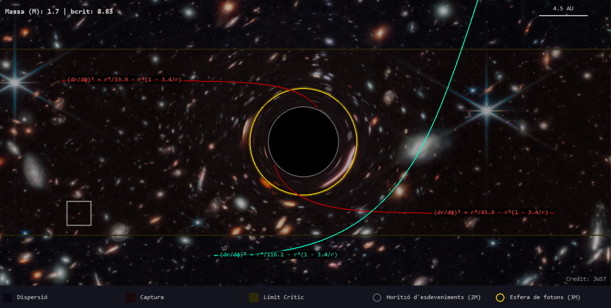
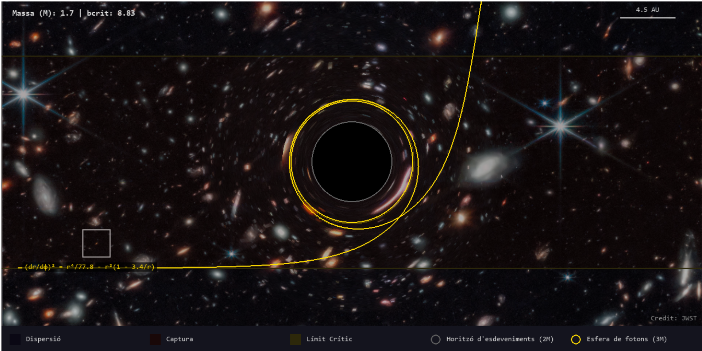

# SIMULACIÓ FORAT NEGRE

## Introducció
Aquest repositori conté l'aplicació pràctica del meu TFG, enfocat en introduir els conceptes necessaris de geometria diferencial, per així introduir-se posteriorment a la teoria de la Relativitat General, i arribar a l'equació d'Einstein. Així doncs, acab mostrant la solució de Shwarzschild i el moviment dels fotons en l'espai-temps resultants. Aquest darrer punt és el que portem a la simulació, per mostrar visualment el comportament de les geodèsiques dels fotons al voltant d'un forat negre sense rotació.  
Al document de ForatNegre.py teniu el codi complet de la simulació de les trajectòries dels fotons amb el que vosaltres podreu interactuar. Per fer-vos una idea de com funcionarà, en el següent enllaç trobareu un petit video on es mostra un forat negre de Schwarzschild en 3 dimensions, per després passar a una pantalla semblant a la que us trobareu vosaltres. Aquí, es llancen trajectòries de fotons generades aleatòriament. https://youtu.be/KvpxktQGTXQ

Entrant en la part matemàtica, hem de resoldre les equacions geodèsiques que seguiran els fotons.
Per la simetria esfèrica de l'espai-temps, podem desfer-nos de $\theta$, en el sentit que qualsevol pla que passi pel centre és equivalent. En particular triam el pla equatorial, amb $\theta(\lambda)=\pi/2$, $\theta'=0$. També, com ens interessa la projecció espaial de la partícula, no tenim en compte $t$, i ens centram amb les coordenades $r$ i $\phi$. En lloc de resoldre equacions de segon ordre amb $r''$ i $\phi''$, introduim els moments $p_r$ i $p_\phi$. Així, s'obtenen les equacions (veure [Olivares](#olivares)) $r'=f(r)p_r$ on $f(r)=1-2M/r$, $p_r'=p_\phi^2/r^3 - (M/r^2)((1/f^2) + p_r^2)$, $\phi'=p_\phi/r^2$, on $p_\phi$ és el moment angular, constant, $p_\phi'=0$. 

El codi resol aquestes equacions numèricament emprant el mètode de Runge Kutta 4 com a cas base: rk4_step(state, mass,h), on state=$(r,\phi,p_r,p_\phi)$, mass la massa del forat negre, i h el pas d'integració.
Agraïr particularment a Hector Olivares, ja que hem seguit principalment l'estructura del seu article: Final Project: Orbits around black holes.
Ara, també hem afegit dos mètodes alternatius: el mètode d'Euler, i el mètode de Runge Kutta 2. Una vegada executat el codi, basta prémer la tecla 1 per mostrar les trajectòries calculades amb Euler, la tecla 2  per mostrar les trajectòries calculades amb Runge Kutta 2, i la tecla 3 (si s'ha canviat abans, d'entrada sempre és Runge Kutta 4) per les trajectòries calculades amb Runge Kutta 4.
Posteriorment, analitzarem les principals diferències entre els tres mètodes.

## How to run
Per executar el programa i recuperar l'animació del vídeo d'abans, heu d'agafar el codi de AnimacioBH.py. Basta copieu el següent text en la vostra terminal (per exemple, la terminal de PyCharm):

git clone https://github.com/psardf03/ForatNegre.git 

cd ForatNegre 

pip install pygame numpy opencv-python 

python AnimacioBH.py 

Quan l'executeu, vos apareixerà en primer lloc la pel·lícula del forat negre en 3 dimensions, mostrant la curvatura de l'espai-temps. Una vegada acabi aquesta animació, passarà tot d'una a llençar trajectòries de fotons de manera aleatòria. S'imprimiran per pantalla fins a 7 trajectòries a la vegada: Quan es superi el límit, es reinicia de nou (simplement la part dels llançaments, no el vídeo del forat negre). En aquest programa no podreu interactuar, simplement observar diferents trajectòries generades aleatòriament. En voler tancar el programa, simplement heu de prémer la tecla Esc del vostre teclat.

Ara, si voleu posar-vos a jugar, simplement heu d'executar el codi Python ForatNegre.py (assegurau-vos de tenir totes les llibreries necessàries, que apareixen a l'inici del document). Com abans, basta copieu el següent text en la vostra terminal (per exemple, la terminal de PyCharm):

git clone https://github.com/psardf03/ForatNegre.git

cd ForatNegre

python -m pip install pygame numpy

python ForatNegre.py

(També s'ha afegit una versió adaptada en google collab d'aquest codi, que podeu trobar a:
https://colab.research.google.com/github/psardf03/ForatNegre/blob/main/Copia_de_ForatNegre.ipynb
)

Se us obrirà una nova finestra, on ja podeu començar a executar les trajectòries que desitjeu. Adalt, on posa massa, aquesta és la massa del forat negre, que podeu canviar al vostre gust, desde 1 fins a 5 (tot i que és aconsellable posar una massa entre 1 i 2 per a que el forat negre no ocupi tota la pantalla). Per canviar-la simplement heu de prémer la fletxa del teclat cap a dalt (augmentar) o cap abaix (disminuir). El bcrit és un paràmetre que relaciona el moment angular de la partícula amb la seva energia. Apareix en els càlculs teòrics de les geodèsiques, i no importa el tengueu en compte a la pràctica. Només afegir que si aquest paràmetre fos exactament bcrit=3·sqrt(3)·M, on M és la massa del forat negre, l'òrbita del fotó seria circular, és a dir, faria voltes indefinidament al voltant del forat negre (Spoiler: els errors numèrics vos impediran recrear aquesta situació a la pràctica). També apareix una escala de 4.5 AU. Això simplement assenyala que aquell segment de pantalla correspon a 4.5 unitats astronòmiques en l'espai-temps que simulam.

Com veureu, en el centre hi ha el forat negre, envoltada en una òrbita gris que, com diu la llegenda, és l'horitzó d'esdeveniments. Quan la partícula arribi a aquesta franja gris, es deixarà de pintar l'òrbita, ja que es sap que no hi ha altre futur possible per a la partícula que caure a la singularitat del forat negre, just al centre de la pantalla. Una òrbita de color groc/daurat apareix propera a l'horitzó d'esdeveniments: l'esfera de fotons. Aquí és on la teoria diu que els fotons quedarien fent voltes indefinidament si el paràmetre bcrit d'abans fos bcrit=3·sqrt(3)·M. El que us passarà amb les trajectòries d'un paràmetre similar és una petita volta al voltant de l'esfera de fotons abans de sortir disparada cap a fora (escapa) o caurà cap a l'horitzó d'esdeveniments (cau a la singularitat).

Hi ha 3 regions diferenciades: la regió de captura, en granat/vermell, representa la zona on amb un llançament horitzontal, el fotó cau directament al forat negre. Això ho aconseguireu fent un simple clic al ratolí en qualsevol punt d'aquesta zona, i la trajectòria pintada serà en vermell (com totes les de captura). La regió de dispersió, en fons negre, correspon a la zona on amb un llançament horitzontal (simplement fent clic al ratolí), el fotó escapa del forat negre i segueix el seu camí. La trajectòria pintada és en verd (com totes les de dispersió). Hi ha una regió molt petita, en groc, que és la regió crítica. Aquí, si llanceu una trajectòria horitzontal, el fotó farà una òrbita com la que hem comentat abans: farà una volta abans de decidir cap on anirà (si caurà o escaparà).

Ara bé, si voleu fer trajectòries més xules, també podeu! Basta situar-vos en el punt on volgueu començar la trajectòria, i arrossegar amb el ratolí. Així, us apareixerà una predicció de com actuarà inicialment la vostra trajectòria, i podeu fer que un fotó en la zona de dispersió caigui al forat negre, o a l'enrevés, que el fotó escapi tirant-lo des de la regió de captura. Tot dependrà de la direcció que li doneu inicialment a la vostra trajectòria. Per últim, si heu pintat moltes corbes a la vostra pantalla, sempre podeu netejar la pantalla prement la tecla C del vostre teclat, no importa reiniciar el programa.

La imatge del background del programa ha estat obtinguda del JWST (James Webb Space Telescope).

## Exemple output
Una vegada executat el programa, podeu fer trajectòries amb llançaments horitzontals, simplement fent clic al ratolí, i obtindreu casos com aquest:

O un cas més interessant com l'òrbita circular:

Si voleu fer vosaltres els llançaments, arrossegau el ratolí en la part de la pantalla on volgueu que comenci la trajectòria, i en haver vist les prediccions i elegit la que volgueu, deixeu anar el ratolí. Obtindreu trajectòries així:

## Comparació numèrica dels mètodes d'integració

Per justificar l'elecció del mètode d'integració, s'han comparat tres mètodes numèrics: Euler, Runge-Kutta de segon ordre (RK2) i Runge-Kutta de quart ordre (RK4). Els tres mètodes s'han aplicat a les mateixes equacions geodèsiques de Schwarzschild i amb les mateixes condicions inicials.

S'han estudiat tres trajectòries dels fotons representatives:

- un fotó que cau dins l'horitzó d'esdeveniments, corresponent al cas de **captura**;
- un fotó molt proper al paràmetre crític, corresponent al cas proper a l'**esfera de fotons**;
- un fotó que s'allunya del forat negre, corresponent al cas de **dispersió**.

En tots els casos s'ha pres \(M=2\), de manera que

\[
b_\text{crit}=3\sqrt{3}M \simeq 10.392.
\]

L'error s'ha calculat comparant l'angle final \(\phi\) obtingut per cada mètode amb una solució de referència calculada amb RK4 i un pas d'integració 20 vegades més petit, ja que no disposem d'una solució analítica simple per comparar. Hem emprat l'angle \phi perquè en la simulació, l'estat del fotó és $(r,\phi,p_r,p_\phi)$, i el fotó pot acabar de dues maneres: captura, si arriba a prop de l'horitzó; o dispersió, si s'allunya molt. Quan acaba, cada mètode dona un valor final de $\phi$. Aquest angle indica per on ha girat el fotó al voltant del forat negre. Si el mètode és poc precís, aquest angle final surt més desviat.
El temps indicat és el temps mitjà necessari per resoldre una trajectòria.

| Fotó | b | Mètode | Destí | Error angular (rad) | Passos | Temps mitjà (ms) |
|---|---:|---|---|---:|---:|---:|
| Captura | 8.000 | Euler | captura | 1.355e-02 | 2337 | 2.287 |
| Captura | 8.000 | RK2 | captura | 1.655e-03 | 2332 | 3.580 |
| Captura | 8.000 | RK4 | captura | 2.685e-05 | 2331 | 6.531 |
| Prop del límit crític | 10.392 | Euler | captura | -- | 8672 | 8.735 |
| Prop del límit crític | 10.392 | RK2 | dispersió | 8.328e-05 | 13314 | 20.701 |
| Prop del límit crític | 10.392 | RK4 | dispersió | 1.014e-08 | 13314 | 37.207 |
| Dispersió | 12.000 | Euler | dispersió | 4.207e-03 | 4190 | 4.141 |
| Dispersió | 12.000 | RK2 | dispersió | 1.446e-06 | 4198 | 6.435 |
| Dispersió | 12.000 | RK4 | dispersió | 2.191e-09 | 4198 | 11.676 |

En el cas proper al límit crític, Euler prediu captura mentre que la referència RK4 prediu dispersió. Per això no s'hi dona error angular: el destí final ja és diferent. Aquest cas mostra que, prop de l'esfera de fotons, petits errors numèrics poden canviar qualitativament el resultat.

Els resultats mostren el comportament esperat. Euler és el mètode més ràpid, perquè només avalua les derivades una vegada per pas, però també és el menys precís. RK2 té un cost intermedi i redueix clarament l'error respecte d'Euler. RK4 és el més costós per pas, ja que fa quatre avaluacions de les derivades, però és el que dona errors més petits i una trajectòria més estable.

Per aquest motiu, RK4 s'ha mantingut com a mètode per defecte de la simulació. Tot i que Euler i RK2 són útils per comparar el comportament dels integradors, RK4 ofereix la millor precisió en les regions sensibles de la trajectòria, especialment prop de \(r=3M\), l'esfera de fotons.

## Bibliografia

H. Olivares, “Orbits around black holes,” 2017.  
Available: https://itp.uni-frankfurt.de/~mwagner/teaching/C_WS17/projects/Orbits_BH.pdf

 

R. K. Sachs and H.-H. Wu, *General Relativity for Mathematicians*, Springer, 1977.

M. P. Hobson, G. Efstathiou, and A. N. Lasenby, *General Relativity: An Introduction for Physicists*.  
Cambridge: Cambridge University Press, 2006.

 
