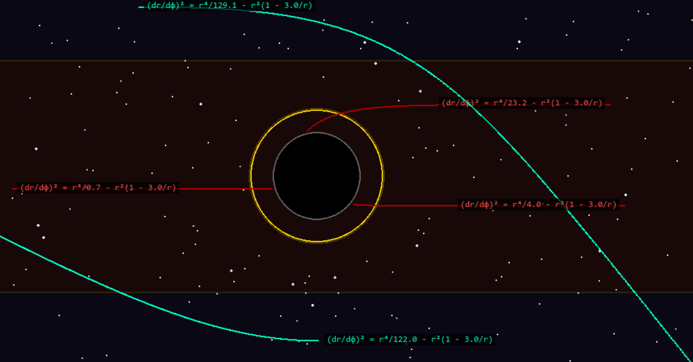
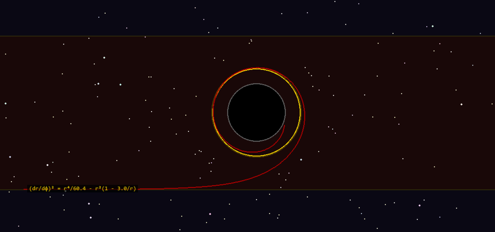
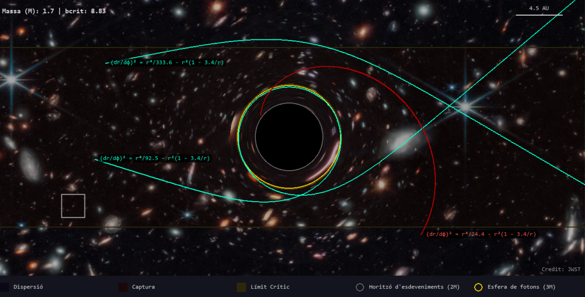

# SIMULACIÓ FORAT NEGRE

## Introducció
Aquest repositori conté l'aplicació pràctica del meu TFG, enfocat en introduir els conceptes necessaris de geometria diferencial, per així introduir-se posteriorment a la teoria de la Relativitat General, i arribar a l'equació d'Einstein. Així doncs, acab mostrant la solució de Shwarzschild i el moviment dels fotons en l'espai-temps resultants. Aquest darrer punt és el que portem a la simulació, per mostrar visualment el comportament de les geodèsiques dels fotons al voltant d'un forat negre sense rotació.  
Al document de ForatNegre.py teniu el codi complet de la simulació de les trajectòries dels fotons amb el que vosaltres podreu interactuar. Per fer-vos una idea de com funcionarà, en el següent enllaç trobareu un petit video on es mostra un forat negre de Schwarzschild en 3 dimensions, per després passar a una pantalla semblant a la que us trobareu vosaltres. Aquí, es llancen trajectòries de fotons generades aleatòriament. https://youtu.be/KvpxktQGTXQ

Entrant en la part matemàtica, hem de resoldre les equacions geodèsiques que seguiran els fotons.
Per la simetria esfèrica de l'espai-temps, podem desfer-nos de $\theta$, en el sentit que qualsevol pla que passi pel centre és equivalent. En particular triam el pla equatorial, amb $\theta(\lambda)=\pi/2$, $\theta'=0$. També, com ens interessa la projecció espaial de la partícula, no tenim en compte $t$, i ens centram amb les coordenades $r$ i $\phi$. En lloc de resoldre equacions de segon ordre amb $r''$ i $\phi''$, introduim els moments $p_r$ i $p_\phi$. Així, s'obtenen les equacions (veure bibliografia) $r'=f(r)p_r$ on $f(r)=1-2M/r$, $p_r'=p_\phi^2/r^3 - (M/r^2)((1/f^2) + p_r^2)$, $\phi'=p_\phi/r^2$, on $p_\phi$ és el moment angular, constant, $p_\phi'=0$. 

El codi resol aquestes equacions numèricament emprant el mètode de Runge Kutta 4: rk4_step(state, mass,h), on state=$(r,\phi,p_r,p_\phi)$, mass la massa del forat negre, i h el pas d'integració.
Agraïr particularment a Hector Olivares, ja que hem seguit principalment l'estructura del seu article: Final Project: Orbits around black holes.

## How to run
Ara, si voleu posar-vos a jugar, simplement heu d'executar el codi Python anterior (assegurau-vos de tenir totes les llibreries necessàries, que apareixen a l'inici del document). Se us obrirà una nova finestra, on ja podeu començar a executar les trajectòries que desitjeu. Adalt, on posa massa, aquesta és la massa del forat negre, que podeu canviar al vostre gust, desde 1 fins a 5 (tot i que és aconsellable posar una massa entre 1 i 2 per a que el forat negre no ocupi tota la pantalla). Per canviar-la simplement heu de prémer la fletxa del teclat cap a dalt (augmentar) o cap abaix (disminuir). El bcrit és un paràmetre que relaciona el moment angular de la partícula amb la seva energia. Apareix en els càlculs teòrics de les geodèsiques, i no importa el tengueu en compte a la pràctica. Només afegir que si aquest paràmetre fos exactament bcrit=3·sqrt(3)·M, on M és la massa del forat negre, l'òrbita del fotó seria circular, és a dir, faria voltes indefinidament al voltant del forat negre (Spoiler: els errors numèrics vos impediran recrear aquesta situació a la pràctica). També apareix una escala de 4.5 AU. Això simplement assenyala que aquell segment de pantalla correspon a 4.5 anys llum en l'espai-temps que simulam.

Com veureu, en el centre hi ha el forat negre, envoltada en una òrbita gris que, com diu la llegenda, és l'horitzó d'esdeveniments. Quan la partícula arribi a aquesta franja gris, es deixarà de pintar l'òrbita, ja que es sap que no hi ha altre futur possible per a la partícula que caure a la singularitat del forat negre, just al centre de la pantalla. Una òrbita de color groc/daurat apareix propera a l'horitzó d'esdeveniments: l'esfera de fotons. Aquí és on la teoria diu que els fotons quedarien fent voltes indefinidament si el paràmetre bcrit d'abans fos bcrit=3·sqrt(3)·M. El que us passarà amb les trajectòries d'un paràmetre similar és una petita volta al voltant de l'esfera de fotons abans de sortir disparada cap a fora (escapa) o caurà cap a l'horitzó d'esdeveniments (cau a la singularitat).

Hi ha 3 regions diferenciades: la regió de captura, en granat/vermell, representa la zona on amb moviment radial, el fotó cau directament al forat negre. Això ho aconseguireu fent un simple clic al ratolí en qualsevol punt d'aquesta zona, i la trajectòria pintada serà en vermell (com totes les de captura). La regió de dispersió, en fons negre, correspon a la zona on amb moviment radial (simplement fent clic al ratolí), el fotó escapa del forat negre i segueix el seu camí. La trajectòria pintada és en blau (com totes les de dispersió). Hi ha una regió molt petita, en groc, que és la regió crítica. Aquí, si llanceu una trajectòria radial, el fotó farà una òrbita com la que hem comentat abans: farà una volta abans de decidir cap on anirà (si caurà o escaparà).

Ara bé, si voleu fer trajectòries més xules, també podeu! Basta situar-vos en el punt on volgueu començar la trajectòria, i arrossegar amb el ratolí. Així, us apareixerà una predicció de com actuarà inicialment la vostra trajectòria, i podeu fer que un fotó en la zona de dispersió caigui al forat negre, o a l'enrevés, que el fotó escapi tirant-lo des de la regió de captura. Tot dependrà de la direcció que li doneu inicialment a la vostra trajectòria. Per últim, si heu pintat moltes corbes a la vostra pantalla, sempre podeu netejar la pantalla prement la tecla C del vostre teclat, no importa reiniciar el programa.

## Exemple output
Una vegada executat el programa, podeu fer trajectòries amb moviment radial, simplement fent clic al ratolí, i obtindreu casos com aquest:

O un cas més interessant com l'òrbita circular:

Si voleu fer voltros els llançaments, arrossegau el ratolí en la part de la pantalla on volgueu que comenci la trajectòria, i en haver vist les prediccions i elegit la que volgueu, deixeu anar el ratolí. Obtindreu trajectòries així:

## Bibliografia
